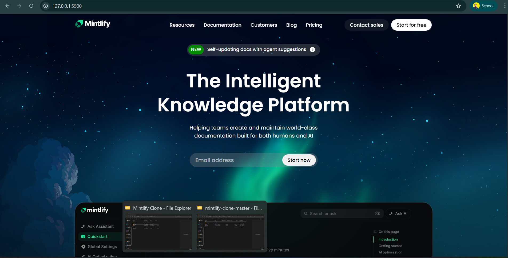
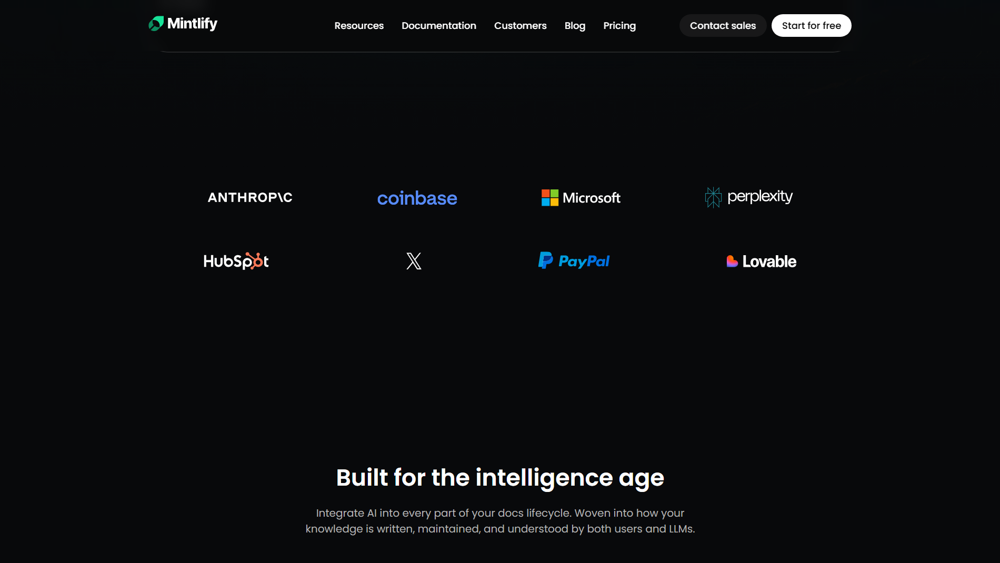
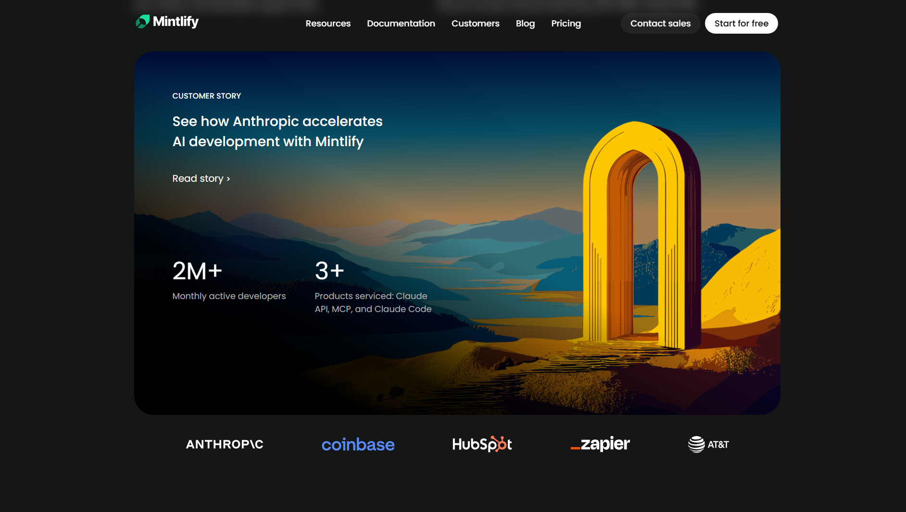
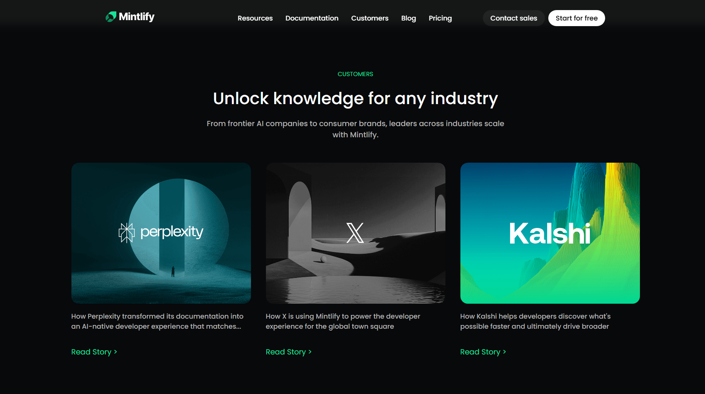
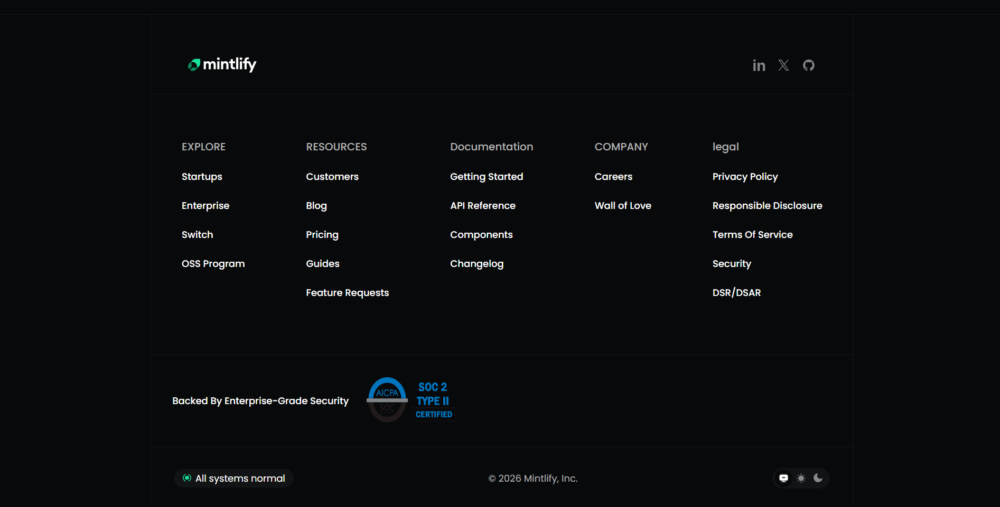

## 📌 Assignment Overview
## Mintlify Documentation Website Clone

**Web Dev Cohort 2026 – HTML & CSS Assignment**

This project is a **desktop-first recreation of the Mintlify documentation website**, built using **only HTML and CSS** as part of the Web Dev Cohort 2026 assignment.  
The focus of this assignment was on **content structure, readability, layout accuracy, and visual fidelity** to the original Mintlify website.

🔗 **Live Deployment:**  
https://himazing-mintlify-frontend.netlify.app

## ⚙️ Constraints Followed

Only **HTML & CSS** used  
No JavaScript  
No TailwindCSS or frameworks  
No AI usage  
No animations or fancy effects  
Desktop-only (no responsiveness)  
Images & icons similar to original site  
Focus on structure, readability, and layout accuracy  

## ▶️ How to Run the Project

1. Clone the repository or download the files
2. Open the `index.html` file
3. Run it in any web browser

```bash
open index.html
````

(or double-click the file)

## 📷 Screenshots

### Hero & Navigation


### Documentation Preview


### Features & UI Preview


### Case Studies Section


### Footer


## 🚀 Deployment

The website is deployed using **Netlify** for easy access and evaluation.

🔗 **Live Site:**  
https://himazing-mintlify-frontend.netlify.app/

## 👤 Author

**Himanshu Kumar**

* LinkedIn: [https://www.linkedin.com/in/himazing](https://www.linkedin.com/in/himazing)
* GitHub: [https://github.com/Himazing](https://github.com/Himazing)
* Portfolio: [https://himanshu-portfolio-tau.vercel.app](https://himanshu-portfolio-tau.vercel.app)


## 📜 License

This project is created for **educational purposes only**.

© 2026 Himanshu Kumar. All rights reserved.

**Built with ❤️ as part of Web Dev Cohort 2026**

